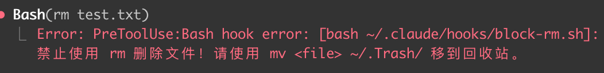
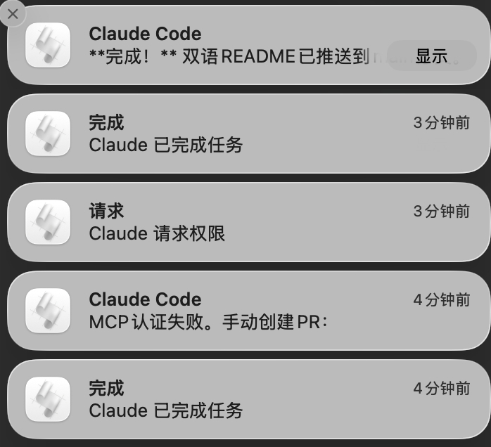

# CCSkills

[English](#english) | [中文](#中文)

---

<a name="english"></a>
## English

Claude Code Hooks that I actually use daily — macOS notifications and safety guards.

Two hooks, one purpose: keep Claude Code safe and responsive.

- **block-rm.sh** — Blocks dangerous `rm` commands, forces Trash instead
- **macOS Notifications** — Native system notifications for permission requests and task completion

---

### Hooks

| Hook | Type | Description |
|------|------|-------------|
| [**block-rm.sh**](hooks/block-rm.sh) | PreToolUse | Prevents irreversible `rm` commands. Claude will use `mv ~/.Trash/` instead |
| **Permission Notification** | PermissionRequest | macOS notification when Claude needs your approval |
| **Completion Notification** | Stop | macOS notification when Claude finishes a task |

---

### Installation

**One-command setup:**

```bash
git clone https://github.com/SlowGrowth1314/CCSkills.git
cd CCSkills
./setup.sh
```

The script will:
- Auto-install `jq` dependency (via Homebrew)
- Copy hooks to `~/.claude/hooks/`
- Merge hooks config into `~/.claude/settings.json` (preserves existing settings)
- Make hooks executable

**Restart Claude Code to apply:**

```bash
claude
```

**Manual installation:**

| Tool | Hooks Path |
|------|------------|
| Claude Code | `~/.claude/hooks/` |

See [hooks-example.json](hooks-example.json) for configuration format.

---

### Why These Hooks?

**block-rm.sh**

`rm` is irreversible. One accidental `rm -rf /*` and your data is gone forever.

This hook:
- Blocks all `rm` commands
- Prompts safer alternatives: `mv <file> ~/.Trash/`
- Works on patterns: `rm file`, `rm -rf dir`, `rm -rf /*`

<p align="center">
  
</p>

**macOS Notifications**

Claude Code runs silently in terminal. You might miss:
- Permission requests waiting for your input
- Tasks completed while you're away

Native macOS notifications:
- **PermissionRequest** → Sound: Hero, grabs your attention
- **Stop** → Sound: Pop, subtle completion signal

<p align="center">
  
</p>

---

### Project Structure

```
CCSkills/
├── hooks/
│   └── block-rm.sh        # rm blocker
├── screenshots/           # Demo screenshots
│   ├── rm-block.png
│   └── notifications.jpg
├── hooks-example.json     # Full config example
├── setup.sh               # One-command installer
├── LICENSE
├── README.md
└── CONTRIBUTING.md
```

---

### License

[MIT](LICENSE)

---

<a name="中文"></a>
## 中文

我日常在用的 Claude Code Hooks — macOS 通知和安全防护。

两个钩子，一个目的：让 Claude Code 更安全、更及时响应。

- **block-rm.sh** — 拦截危险的 `rm` 命令，强制使用回收站
- **macOS 通知** — 权限请求和任务完成时的系统通知

---

### 钩子列表

| 钩子 | 类型 | 说明 |
|------|------|------|
| [**block-rm.sh**](hooks/block-rm.sh) | PreToolUse | 拦截不可逆的 `rm` 命令，Claude 会改用 `mv ~/.Trash/` |
| **权限通知** | PermissionRequest | Claude 需要你批准时弹出 macOS 通知 |
| **完成通知** | Stop | Claude 完成任务时弹出 macOS 通知 |

---

### 安装方式

**一键安装：**

```bash
git clone https://github.com/SlowGrowth1314/CCSkills.git
cd CCSkills
./setup.sh
```

脚本会自动：
- 安装 `jq` 依赖（通过 Homebrew）
- 复制钩子到 `~/.claude/hooks/`
- 合并配置到 `~/.claude/settings.json`（保留已有设置）
- 设置钩子可执行权限

**重启 Claude Code 生效：**

```bash
claude
```

**手动安装：**

| 工具 | 钩子路径 |
|------|----------|
| Claude Code | `~/.claude/hooks/` |

配置格式见 [hooks-example.json](hooks-example.json)。

---

### 为什么需要这些钩子？

**block-rm.sh**

`rm` 不可逆。一次误操作 `rm -rf /*`，数据永远消失。

这个钩子：
- 拦截所有 `rm` 命令
- 提示更安全的替代：`mv <file> ~/.Trash/`
- 拦截模式：`rm file`、`rm -rf dir`、`rm -rf /*`

<p align="center">
  
</p>

**macOS 通知**

Claude Code 在终端静默运行。你可能错过：
- 权限请求在等你输入
- 任务完成时你不在

原生 macOS 通知：
- **PermissionRequest** → 声音：Hero，引起注意
- **Stop** → 声音：Pop，轻微完成提示

<p align="center">
  
</p>

---

### 项目结构

```
CCSkills/
├── hooks/
│   └── block-rm.sh        # rm 拦截器
├── hooks-example.json     # 完整配置示例
├── setup.sh               # 一键安装脚本
├── LICENSE
├── README.md
└── CONTRIBUTING.md
```

---

### 许可证

[MIT](LICENSE)